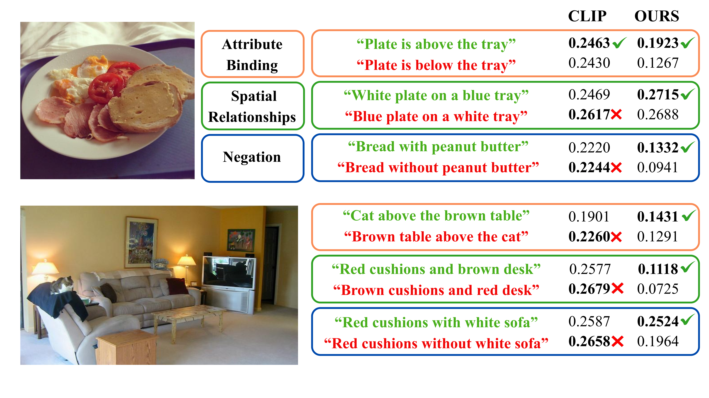
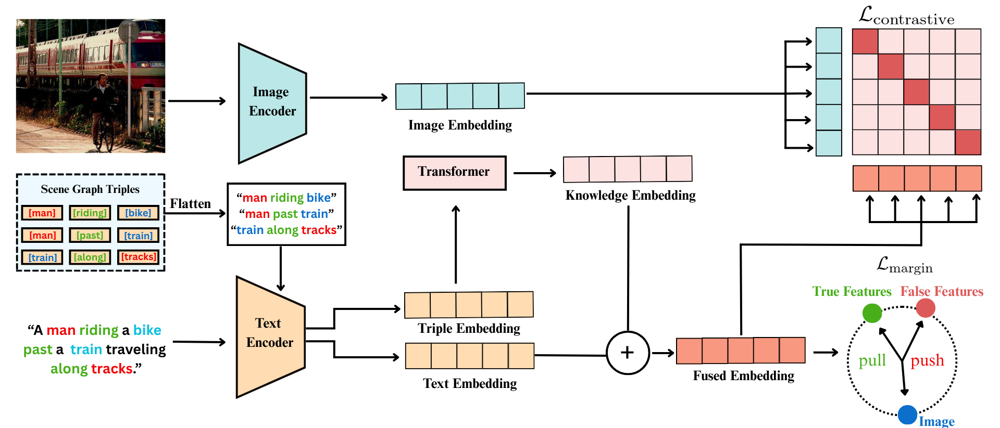
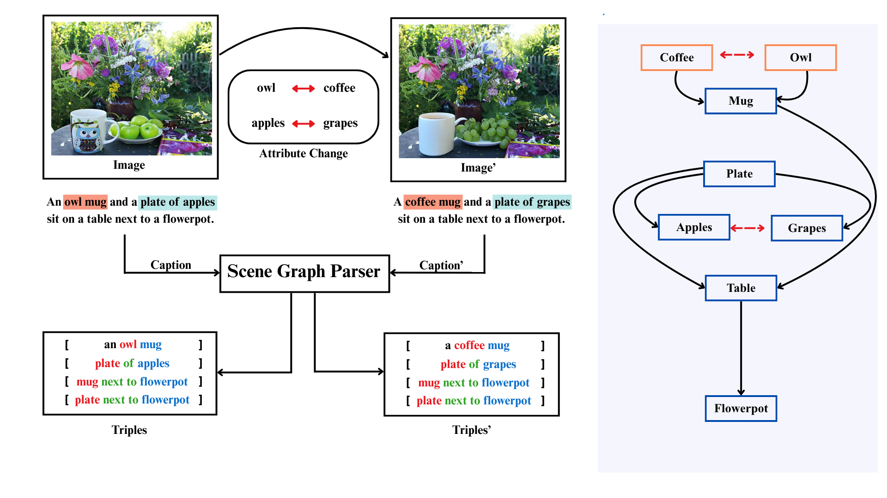
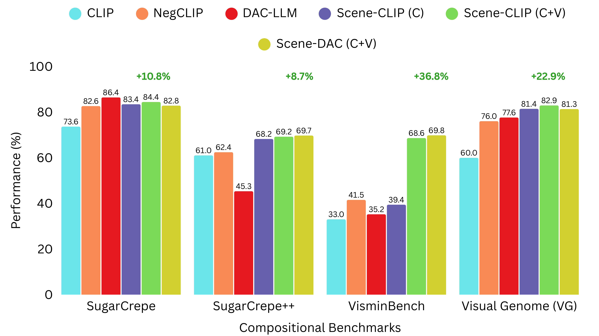
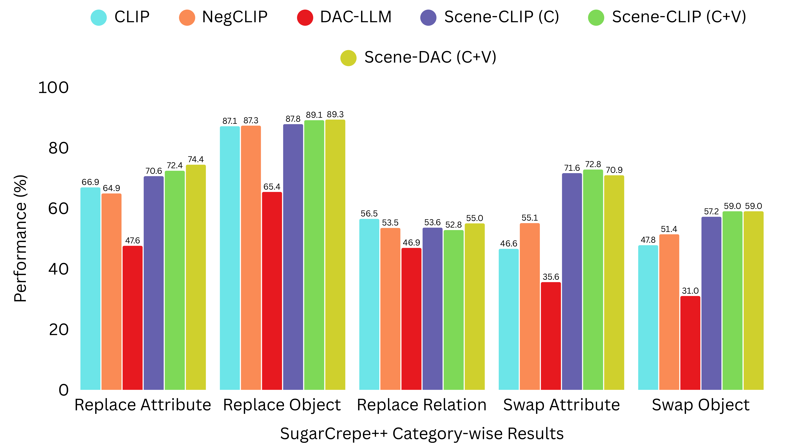
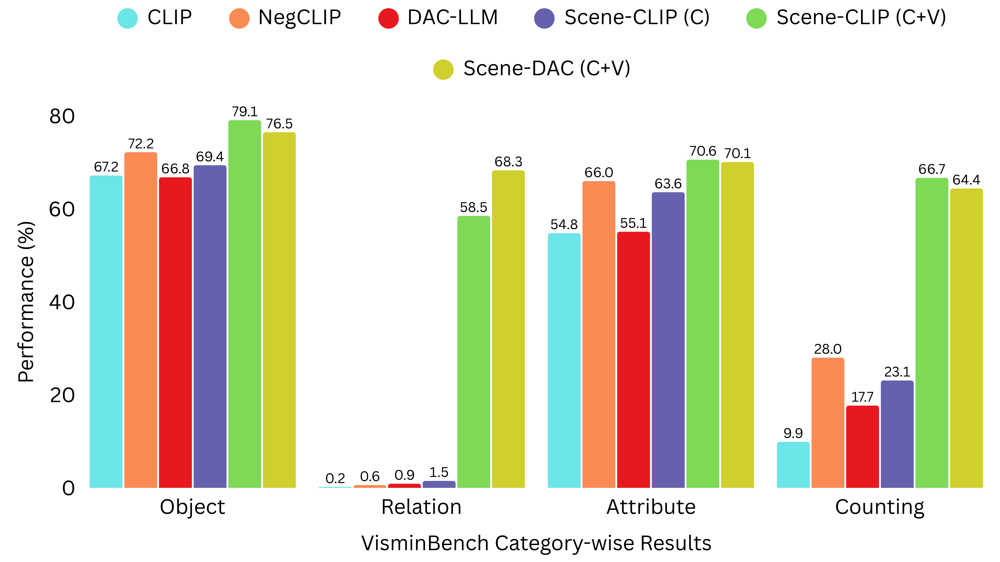

# Scene-CLIP: Enhancing Compositional Scene Understanding With Scene Graphs

**Accepted to ECML-PKDD 2026 — Research Track**

*Akash Kamalesh, Tanistha Hota, Gowri Srinivasa*
PES Center for Pattern Recognition, Department of Computer Science and Engineering, PES University, Bengaluru, India

[Paper](https://link.springer.com/chapter/10.1007/978-3-032-37667-1_10) [[Supplementary](Supplementary.pdf)]

---

## Overview

CLIP tends to behave like a "bag-of-words" encoder: it often assigns near-identical scores to a caption and its structurally scrambled counterpart (e.g. *"a man riding a bike past a train"* vs. *"a train riding a man past a bike"*). As a result, it struggles with attribute binding, spatial relations, and negation, even when all the right words are present.

**Scene-CLIP** addresses this by injecting scene graph knowledge (⟨subject, relation, object⟩ triples) directly into CLIP's own embedding space, rather than using a separate graph encoder like Structure-CLIP. Each triple is linearized as text and encoded with CLIP's own text encoder, then aggregated by a lightweight 2-layer transformer (adding ~2.1M parameters, 157.58M total) into a structural embedding that is fused with the caption embedding. Training combines a contrastive loss on this fused feature with a margin-ranking loss over a dual negative-sampling strategy: syntactic swaps (subject/object and attribute swaps) from COCO, and semantic hard negatives (object/attribute/relation/count edits) from VisMin. On average this improves ~12% over CLIP across SugarCrepe, SugarCrepe++, Visual Genome and VisMin, while keeping COCO retrieval in line with NegCLIP/Structure-CLIP.

<p align="center">
  
</p>

<p align="center"><em>Fig. 1 — CLIP assigns near-identical cosine similarity to a caption and its structurally altered counterpart (attribute swaps, spatial-relation flips, negation). Scene-CLIP ("OURS") separates these pairs correctly.</em></p>

<p align="center">
  
</p>

<p align="center"><em>Fig. 3 — Scene-CLIP architecture. Captions are parsed into scene-graph triples, flattened and encoded with CLIP's text encoder, then aggregated by a lightweight transformer into a Knowledge Embedding. This is fused with the global Text Embedding and optimized jointly with a contrastive loss (image ↔ fused text) and a margin loss (true vs. false caption ranking).</em></p>

<p align="center">
  
</p>

<p align="center"><em>Fig. 2 — Semantic negative sampling: original and minimally-edited (hard-negative) image/caption pairs from VisMin are both parsed into scene-graph triples, giving the model paired supervision at the triple level.</em></p>

### Results at a glance

<p align="center">
  
</p>

<p align="center"><em>Comparison across SugarCrepe, SugarCrepe++, Visual Genome, and VisMin.</em></p>

| Benchmark | Metric | CLIP ViT-B/32 | Structure-CLIP | Scene-CLIP (C+V) |
|---|---|---|---|---|
| SugarCrepe | Avg. Accuracy | 73.6 | 82.2 | 85.2 |
| SugarCrepe++ | ITT Avg. | 61.0 | 67.8 | 69.2 |
| Visual Genome | Attr. / Rel. Acc. | 60.1 / 59.8 | 81.3 / 83.8 | 82.5 / 83.3 |
| VisMin | Group Retrieval (Avg.) | 33.0 | 68.0 | 68.6 |
| COCO Retrieval | T→I R@1 | 30.4 | 39.6 | 41.1 |
| Parameters | Total | — | 220M | 157.58M |

Full results tables (Tables 1–6) and ablations on the fusion weight λ, training-data mix, loss components, encoder freezing, and knowledge-aggregation variants can be found in the paper.

<p align="center">
  
  
</p>

<p align="center"><em>Category-wise breakdown on SugarCrepe++ (replace/swap × attribute/object/relation) and VisMin (object, relation, attribute, counting) group scores.</em></p>

---

## Repository Structure

```
├── Supplementary.pdf                       # Supplementary material
├── Inference_samples.ipynb                 # Qualitative inference examples (CLIP / NegCLIP / Scene-CLIP)
├── environment.sh                          # One-shot dependency installer
├── data/                                   # Captions, scene-graph triples and benchmark metadata
│   ├── train_coco_aug_withneg_adjchange_merge.json   # COCO + syntactic-negative training captions
│   ├── test_coco_aug_withneg_objectchange_relation.json
│   ├── visual_genome_attribution_aug.json  # Visual Genome Attribution (train/test split via --train_path/--test_path)
│   ├── visual_genome_relation_aug.json     # Visual Genome Relation
│   ├── vismin_triples.jsonl                # Scene-graph triples for VisMin train/bench images
│   ├── sugarcrepe_triples.jsonl            # Scene-graph triples (true/false) for SugarCrepe
│   ├── sugarcrepe_replace_object_{true,false}_captions.json
│   ├── sc_swap_obj.json / sc_swap_att.json
│   ├── winoground_triples_{0,1}.txt / winoground_part{1,2}.json
│   └── image_triples.jsonl
├── model/                                  # Core implementation
│   ├── model.py                            # SceneCLIP model + TripleAggregationTransformer
│   ├── train.py                            # Training entrypoint (joint train + per-epoch eval)
│   ├── eval.py                              # Evaluation routines for every benchmark
│   ├── utils.py                            # CLI args, losses (CLIP/Margin/Triplet/Wino), transforms, seeding
│   ├── dataloader.py                       # COCO caption/triple dataset
│   ├── dataloader_downstream.py            # VG, VisMin, SugarCrepe(++), Winoground datasets
│   ├── clip.py / simple_tokenizer.py        # Vendored OpenAI CLIP loader + BPE tokenizer
│   └── model_zoo/                          # Optional baselines used for comparison (BLIP, XVLM, FLAVA, CLIP)
├── script/
│   └── run.sh                              # Reference training launch command (paper configuration)
└── figures/                                 # Paper figures used in this README
```

## Requirements & Installation

- Python ≥ 3.8 (tested), PyTorch tested on 2.7.0
- A CUDA-capable GPU is expected (paper experiments used a single NVIDIA A100 40GB)

Install everything with the provided script, which sets up CLIP, the scene-graph parsing libraries, and all supporting packages:

```bash
git clone <this-repo>
cd Scene-CLIP
chmod +x environment.sh
./environment.sh
```

This installs, among others: `transformers`, `datasets`, `wandb`, `open_clip_torch`, `spacy` (+ `en_core_web_sm`), `SceneGraphParser`, `discosg`, `FactualSceneGraph`, and OpenAI's `CLIP` from GitHub.

> Training logs metrics to [Weights & Biases](https://wandb.ai/). Run `wandb login` (or set `WANDB_MODE=offline`) before training.

## Data

The `data/` folder already ships the pre-parsed scene-graph triples and augmented captions needed to reproduce the paper (COCO syntactic negatives, VisMin/VG/SugarCrepe/SugarCrepe++/Winoground triples). `model/train.py` additionally streams the following datasets directly from the Hugging Face Hub on first run (cached afterward):

- `mair-lab/vismin` — VisMin training split (semantic hard negatives), joined with `data/vismin_triples.jsonl`
- `haideraltahan/wds_sugarcrepe` — SugarCrepe test split, joined with `data/sugarcrepe_triples.jsonl`
- `AsphyXIA/vismin-bench` — VisMin benchmark split for evaluation

No manual download step is required beyond having internet access and being logged into `huggingface-cli` if the datasets are gated.

## Training

The reference training configuration lives in `script/run.sh`:

```bash
cd script
bash run.sh
```

which runs:

```bash
model=openai-clip:ViT-B/32

CUDA_VISIBLE_DEVICES=0 python ./model/train.py \
  --project PROJECT_NAME \
  --name RUN_NAME \
  --model-name=$model \
  --train_path data/train_coco_aug_withneg_adjchange_merge.json \
  --test_path data/visual_genome_attribution_aug.json \
  --manualSeed 120 \
  --batch_size 100 \
  --lr 5e-6 \
  --epoch 10 \
  --weight_decay 0.1 \
  --knowledge_weight 0.2 \
  --transformer_layer_num 6 \
  --neg_loss_weight 5 \
  --device=cuda
```

Set `--project` / `--name` to your own W&B project/run name before launching. Checkpoints are written to `checkpoints/{name}/`, and every epoch automatically evaluates on COCO retrieval, Visual Genome (Relation/Attribution), SugarCrepe, SugarCrepe++, VisMin, and Winoground — results are printed as tables and logged to W&B.

Key CLI flags (see `model/utils.py::get_args`):

| Flag | Default | Meaning |
|---|---|---|
| `--train_path` / `--test_path` | COCO/VG augmented caption files | Training/eval caption+triple data |
| `--batch_size`, `--lr`, `--epoch`, `--weight_decay` | 128 / 2e-7 / 10 / 0.1 | Standard optimization hyperparameters |
| `--knowledge_weight` | 0.01 | Fusion weight λ between caption and structural features (paper default: **0.2**) |
| `--transformer_layer_num` | 4 | Layers in the triple aggregator (paper default: **2**, see Table 6 ablation for variants) |
| `--neg_loss_weight` | 1 | Weight on the margin-ranking loss term |
| `--num_triples` | 3 | Max scene-graph triples used per caption |
| `--mean_pool` | off | Ablation: replace the triple aggregator with mean pooling |
| `--freeze_vision` / `--freeze_text` / `--freeze_all` | off | Ablation: freeze one or both CLIP towers during training |
| `--gradient_accumulation_steps` | 1 | Gradient accumulation for larger effective batch sizes |

## Evaluation

Evaluation is integrated into `model/train.py` and runs automatically after every epoch — there is no separate standalone eval script to invoke. The routines in `model/eval.py` implement:

- `eval_coco_large` — COCO Recall@1/5/10 (text↔image)
- `test_vg_relation`, `test_vg_attribution` — Visual Genome Relation/Attribution accuracy
- `evaluate_semantic_composition`, `evaluate_semantic_composition_scpp` — SugarCrepe / SugarCrepe++
- `eval_vismin_bench` — VisMin (object/relation/attribute/counting, Text/Image/Group scores)

To evaluate a saved checkpoint, load it into `SceneCLIP` inside a small script and call the relevant `eval.py` function with the corresponding dataloader from `dataloader_downstream.py` (mirroring the setup already built in `model/train.py`).

## Inference / Qualitative Examples

`Inference_samples.ipynb` shows how to score caption pairs against an image with CLIP, NegCLIP, and Scene-CLIP side by side (reproducing examples like Fig. 1). Open it in Jupyter/VS Code and run cells top to bottom; it installs its own CLIP/open_clip dependencies inline.

## Model Architecture Notes

- `model/model.py::SceneCLIP` wraps a CLIP backbone (`clip.py`, vendored from OpenAI CLIP) and adds a `TripleAggregationTransformer`.
- Each scene-graph triple is linearized to text (e.g. `"man on horse"`) and encoded with CLIP's text tower; the resulting triple embeddings are aggregated via a `[CLS]`-token transformer (`AggregationTransformer` / `AggregationResidualAttentionBlock`) into a single structural embedding `S`.
- The fused text feature is `F = C + λ · S` (Eq. 2), used for the contrastive loss; the margin loss (`utils.py::MarginLoss`) ranks true captions above false captions directly on caption features `C`.
- `model_zoo/` contains additional baseline model wrappers (BLIP, X-VLM, FLAVA, CLIP) used only for baseline comparison in the paper's tables, not required to train/run Scene-CLIP itself.

## Citation

If you use this code or build on Scene-CLIP, please cite:

```bibtex
@inproceedings{kamalesh2027sceneclip,
  title     = {Scene-CLIP: Enhancing Compositional Scene Understanding With Scene Graphs},
  author    = {Kamalesh, Akash and Hota, Tanistha and Srinivasa, Gowri},
  booktitle = {Proceedings of the European Conference on Machine Learning and Principles and Practice of Knowledge Discovery in Databases (ECML PKDD)},
  series    = {LNAI},
  volume    = {16944},
  pages     = {158--175},
  year      = {2027},
  publisher = {Springer Nature Switzerland},
  doi       = {10.1007/978-3-032-37667-1_10}
}
```

## License

Released under the [Apache License 2.0](LICENSE).